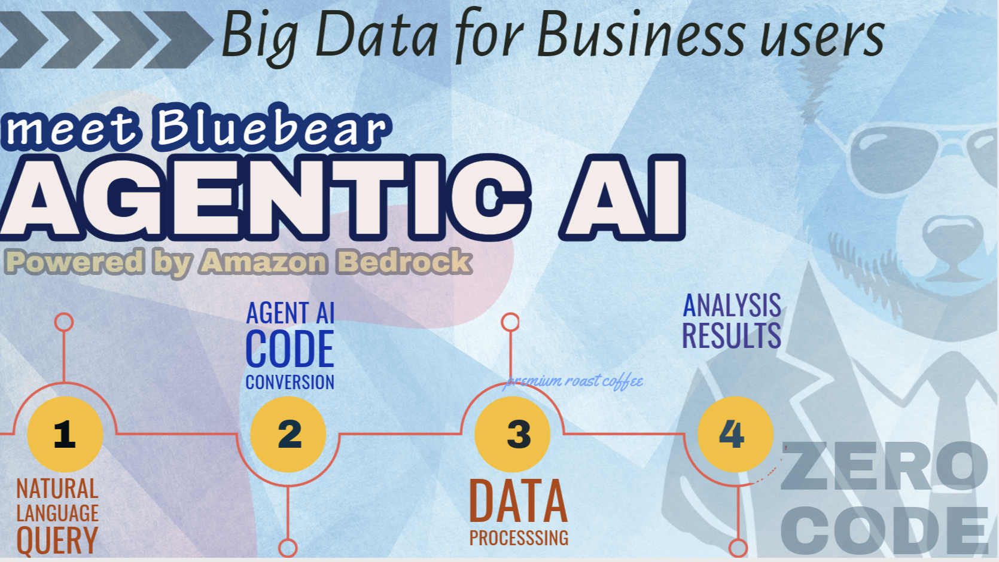

# Project Bluebear - Big Data for Business Users
Project Bluebear is an attempt to allow business users to use natural language queries for performing Big Data Analytics and receive results. It provides a zero code conversational interface where users can ask questions, upload documents, and receive responses from the AI assistant. Under the hood it uses GenAI to convert natural language queries into Spark code for performing big data analytics. 




## Architecture
This project provides a conversational interface using [Bedrock Claude Chatbot](https://github.com/aws-samples/bedrock-claude-chatbot). Amazon Bedrock is used for generating the spark code based on the user prompt. The spark code is then run on a lightweight [Apache Spark on AWS Lambda(SoAL) framework](https://github.com/aws-samples/spark-on-aws-lambda) to provide analysis results to the user. If the input data file is small (<=500 MB), Spark on AWS Lambda (SoAL) is used for data processing. If the input data file is larger, Amazon EMR Serverless is used for data processing. SoAL helps with quick data processing and can provide the results in realtime. With Amazon EMR Serverless, users will receive results once the data processing is finished based on the size of the input data set.


## Pre-Requisites
1. [Amazon Bedrock Anthropic Claude Model Access](https://docs.aws.amazon.com/bedrock/latest/userguide/model-access.html)
2. [S3 bucket](https://docs.aws.amazon.com/AmazonS3/latest/userguide/create-bucket-overview.html) to store uploaded documents and Textract output.
3. [Amazon Elastic Container Registry](https://docs.aws.amazon.com/AmazonECR/latest/userguide/repository-create.html) to store custom docker images.
4. Optional:
    - Create an Amazon DynamoDB table to store chat history (Run the notebook **BedrockChatUI** to create a DynamoDB Table). This is optional as there is a local disk storage option, however, I would recommend using Amazon DynamoDB.
    - Amazon Textract. This is optional as there is an option to use python libraries [`pypdf2`](https://pypi.org/project/PyPDF2/) and [`pytessesract`](https://pypi.org/project/pytesseract/) for PDF and image processing. However, I would recommend using Amazon Textract for higher quality PDF and image processing. You will experience latency when using `pytesseract`.

To use the **Advanced Analytics Feature**, this additional step is required (ChatBot can still be used without enabling `Advanced Analytics Feature`):

5. [Amazon Lambda](https://docs.aws.amazon.com/lambda/latest/dg/python-image.html#python-image-clients) function with custom python image to execute python code for analytics.
    - Create an private ECR repository by following the link in step 3.
    - On your local machine or any related AWS services including [AWS CloudShell](https://docs.aws.amazon.com/cloudshell/latest/userguide/welcome.html), [Amazon Elastic Compute Cloud](https://aws.amazon.com/ec2/getting-started/), [Amazon Sageamker Studio](https://aws.amazon.com/blogs/machine-learning/accelerate-ml-workflows-with-amazon-sagemaker-studio-local-mode-and-docker-support/) etc. run the following CLI commands:
        - install git and clone this git repo `git clone [github_link]`
        - navigate into the Docker directory `cd Docker`
        - if using local machine, authenticate with your [AWS credentials](https://docs.aws.amazon.com/cli/v1/userguide/cli-chap-authentication.html)
        - install [AWS Command Line Interface (AWS CLI) version 2](https://docs.aws.amazon.com/cli/latest/userguide/getting-started-install.html) if not already installed.
        - Follow the steps in the **Deploying the image** section under **Using an AWS base image for Python** in this [documentation guide](https://docs.aws.amazon.com/lambda/latest/dg/python-image.html#python-image-instructions). Replace the placeholders with the appropiate values. You can skip step `2` if you already created an ECR repository.
        - In step 6, in addition to `AWSLambdaBasicExecutionRole` policy, **ONLY** grant [least priveledged read and write Amazon S3 policies](https://docs.aws.amazon.com/IAM/latest/UserGuide/reference_policies_examples_s3_rw-bucket.html) to the execution role. Scope down the policy to only include the necessary S3 bucket and S3 directory prefix where uploaded files will be stored and read from as configured in the `config.json` file below.
        - In step 7, I recommend creating the Lambda function in a [Amazon Virtual Private Cloud (VPC)](https://docs.aws.amazon.com/lambda/latest/dg/configuration-vpc.html) without [internet access](https://docs.aws.amazon.com/vpc/latest/userguide/vpc-example-private-subnets-nat.html) and attach Amazon S3 and Amazon CloudWatch [gateway](https://docs.aws.amazon.com/vpc/latest/privatelink/vpc-endpoints-s3.html) and [interface endpoints](https://docs.aws.amazon.com/vpc/latest/privatelink/create-interface-endpoint.html#create-interface-endpoint.html) accordingly. The following step 7 command can be modified to include VPC paramters:
        ```
        aws lambda create-function \
            --function-name YourFunctionName \
            --package-type Image \
            --code ImageUri=your-account-id.dkr.ecr.your-region.amazonaws.com/your-repo:tag \
            --role arn:aws:iam::your-account-id:role/YourLambdaExecutionRole \
            --vpc-config SubnetIds=subnet-xxxxxxxx,subnet-yyyyyyyy,SecurityGroupIds=sg-zzzzzzzz \
            --memory-size 512 \
            --timeout 300 \
            --region your-region
        ```

        Modify the placeholders as appropiate. I recommend to keep `timeout` and `memory-size` params conservative as that will affect cost. A good staring point for memory is `512` MB.
        - Ignore step 8.
        
**⚠ IMPORTANT SECURITY NOTE:**

Enabling the **Advanced Analytics Feature** allows the LLM to generate and execute Python code to analyze your dataset that will automatically be executed in a Lambda function environment. To mitigate potential risks:

1. **VPC Configuration**: 
- It is recommended to place the Lambda function in an internet-free VPC.
- Use Amazon S3 and CloudWatch gateway/interface endpoints for necessary access.

2. **IAM Permissions**: 
- Scope down the Lambda execution role to only Amazon S3 and the required S3 resources. This is in addition to `AWSLambdaBasicExecutionRole` policy.

3. **Library Restrictions**: 
- Only libraries specified in `Docker/requirements.txt` will be available at runtime.
- Modify this list carefully based on your needs.

4. **Resource Allocation**: 
- Adjust Lambda `timeout` and `memory-size` based on data size and analysis complexity.

5. **Production Considerations**: 
- This application is designed for POC use.
- Implement additional security measures before deploying to production.

The goal is to limit the potential impact of generated code execution.

##Configuration
To customize the behavior for the conversational chatbot follow [these](https://github.com/aws-samples/bedrock-claude-chatbot/tree/main?tab=readme-ov-file#configuration) instructions.


## Deploy and run Streamlit App on AWS EC2 (I tested this on the Ubuntu Image)
* [Create a new ec2 instance](https://docs.aws.amazon.com/AWSEC2/latest/UserGuide/EC2_GetStarted.html)
* Expose TCP port range 8500-8510 on Inbound connections of the attached Security group to the ec2 instance. TCP port 8501 is needed for Streamlit to work. See image below
* 
* EC2 [instance profile role](https://docs.aws.amazon.com/IAM/latest/UserGuide/id_roles_use_switch-role-ec2_instance-profiles.html) has the required permissions to access the services used by this application mentioned above.
* [Connect to your ec2 instance](https://docs.aws.amazon.com/AWSEC2/latest/UserGuide/AccessingInstances.html)
* Run the appropiate commands to update the ec2 instance (`sudo apt update` and `sudo apt upgrade` -for Ubuntu)
* Clone this git repo `git clone [github_link]`
* Install python3 and pip if not already installed, `sudo apt install python3` and `sudo apt install python3-pip`.
* If you decide to use Python Libs for PDF and image processing, this requires tesserect-ocr. Run the following command:
    - If using Centos-OS or Amazon-Linux:
        - sudo rpm -Uvh https://dl.fedoraproject.org/pub/epel/epel-release-latest-7.noarch.rpm
        - sudo yum -y update
        - sudo yum install -y tesseract
    - For Ubuntu or Debian:
        - sudo apt-get install tesseract-ocr-all -y
* Install the dependencies by running the command `sudo pip install -r req.txt --upgrade`
* Run command `tmux new -s mysession` to create a new session. Then in the new session created `cd` into the **ChatBot** dir and run `python3 -m streamlit run bedrock-chat.py` to start the streamlit app. This allows you to run the Streamlit application in the background and keep it running even if you disconnect from the terminal session.
* Copy the **External URL** link generated and paste in a new browser tab.
* **⚠ NOTE:** The generated link is not secure! For [additional guidance](https://github.com/aws-samples/deploy-streamlit-app). 
To stop the `tmux` session, in your ec2 terminal Press `Ctrl+b`, then `d` to detach. to kill the session, run `tmux kill-session -t mysession`

## Future Road Map
TBD

## Cleanup

## Contributions

## Security

## License