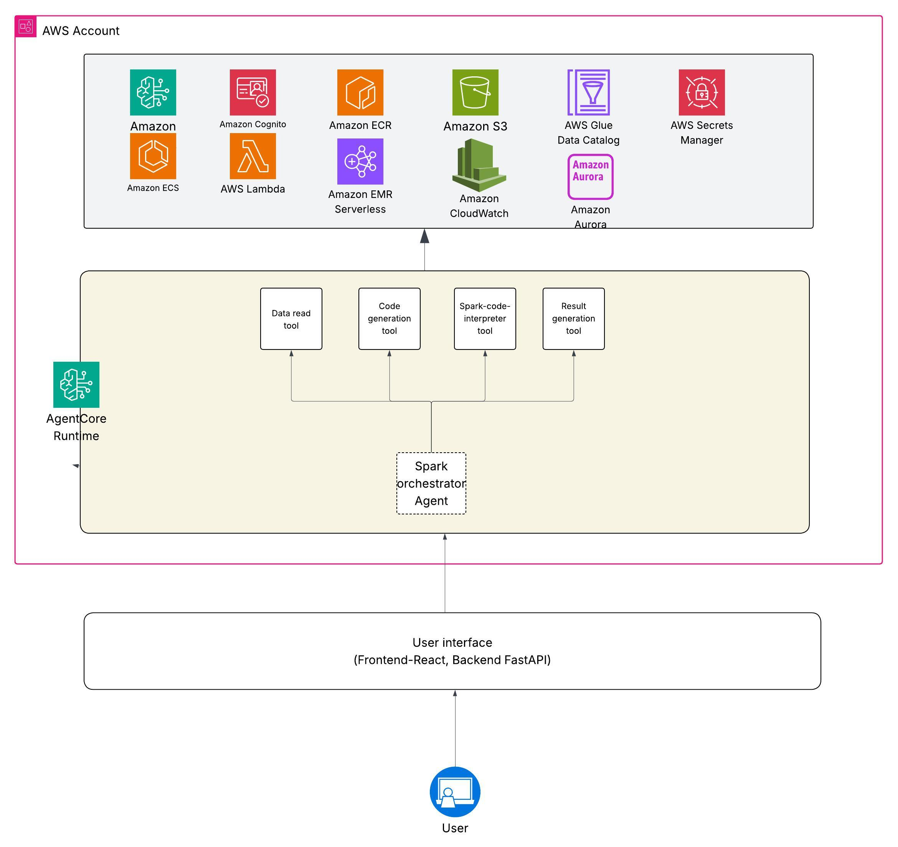

# Project Bluebear - Big Data for Business Users
Project Bluebear is a cutting-edge conversational Gen AI solution designed to analyze datasets ranging from megabytes (MBs) to petabytes (PBs) using Amazon Bedrock Agents and Apache Spark. This framework provides two seamless execution options:

* Spark on AWS Lambda (SoAL) – A lightweight, real-time processing engine for datasets up to 500MB, supporting single-node spark execution for optimized performance.

* Amazon EMR Serverless – A scalable solution for handling larger datasets, ensuring efficient heavy-lifting for extensive data analysis.

## How It Works

* Conversational Interface – Business users submit natural language queries.

* AI-Powered Code Generation – Amazon Bedrock dynamically generates Spark code based on the user’s prompt.

* Intelligent Execution – The Spark code runs on a dropdown interface, allowing users to choose between SoAL (Spark on AWS Lambda) and Amazon EMR Serverless, providing a cost-conscious option for executing their queries.

    * SoAL (Spark on AWS Lambda) for quick, real-time analysis of smaller datasets.

    * Amazon EMR Serverless for processing larger datasets, including petabytes of data, with robust computational power.

## Solving a Critical Pain Point

Natural language should be the new way of interacting with data, eliminating the need to spend months on ETL frameworks and deployment. Project Bluebear enables business users to perform analytics effortlessly through natural language queries, providing actionable insights in real time or at scale.


## Architecture
# Spark Code Interpreter for Amazon Bedrock 

Spark Code Interpreter is a **conversational analytics** solution that lets business users analyze large datasets in natural language while AI automatically generates, validates, and executes PySpark code on AWS.[1] This solution—codenamed **Project Bluebear**—extends Amazon Bedrock's agentic capabilities with dual execution backends: **Spark on AWS Lambda (SoAL)** for fast iterative code validation and **Amazon EMR Serverless** for production-scale analytics.[2]

## Architecture Overview

### Solution Flow

1. **Natural Language Prompt** → User asks a question via Streamlit UI: *"Show me total sales by region over the last 12 months."*

2. **Bedrock Model Generation** → Amazon Bedrock (Claude) generates a PySpark script based on:
   - User's natural-language prompt
   - Known dataset schema stored in metadata
   - Historical context from previous queries

3. **Fast Validation Loop** → Generated code is run on **Spark on AWS Lambda (SoAL)** to:
   - Validate syntax and logic (~550ms response time)
   - Surface errors back to the model for repair
   - Iterate 3–4 times until code succeeds (typically within seconds)

4. **Production Execution** → Once validated, the same PySpark script executes on **Amazon EMR Serverless**:
   - Accesses full dataset (MBs to PBs)
   - Performs the actual analysis
   - Returns results and metrics to the UI

5. **Natural Language Summary** → Bedrock summarizes results and visualizes them in Streamlit


### Key Components

| Component | Purpose | Details |
|-----------|---------|---------|
| **AgentCore Runtime** | Agent + tool hosting | Runs the Spark orchestrator agent and its tools (data read, code generation, Spark‑code‑interpreter, result generation) inside AgentCore. |
| **Spark orchestrator agent** | Controls end‑to‑end workflow | Orchestrates the sequence: read data → generate PySpark → execute via Spark‑code‑interpreter tool → generate and format results. |
| **Data read tool** | Accesses datasets | Reads data from sources like Amazon S3 / Glue catalog(extend to Snowflake, Databricks and other using MCP) and hands sampled or full datasets to the orchestrator. |
| **Code generation tool** | Builds PySpark code | Generates or refines PySpark based on the user request and available schema/metadata. |
| **Spark‑code‑interpreter tool** | Interprets Spark code | Interprets the generated code, itertively fixes the code if there are issues in generated code by Code generation tool|
| **Result generation tool** | Produces user‑friendly outputs | Aggregates Spark results and turns them into tables, charts, and natural‑language summaries. |
| **User interface (React + FastAPI)** | Front‑end & API layer | React front‑end and FastAPI backend that collect user questions, send them to AgentCore, and render results back to users. |
| **AWS services (S3, EMR Serverless, Lambda, CloudWatch, etc.)** | Data, compute, and observability | Provide underlying storage, Spark execution, auxiliary compute, and logging/monitoring used by the tools and agent. |


---

## Features

✅ **Natural-language to PySpark code generation** using Amazon Bedrock Claude  
✅ **Iterative code validation loop** → Error detection, model repair, re-validation  
✅ **Dual execution backends:**
- **SoAL** (fast, low-latency) for validation and queries <500 MB
- **EMR Serverless** (scalable) for large-scale analytics MBs → PBs  

✅ **Streamlit web UI** for:
- Dataset selection and schema exploration
- Generated PySpark code review and editing
- Tabular and chart result visualization

✅ **Security & governance:**
- Scoped IAM roles (least-privilege S3, Lambda, EMR Serverless access)
- VPC-enabled execution with private S3 access
- Audit logs in CloudWatch

✅ **Cost-effective & extensible:**
- Pay only for actual compute time
- Reuse same PySpark scripts across SoAL, EMR Serverless, and AWS Glue
- Pluggable backend configuration

---

## Architecture Decision: SoAL vs. EMR Serverless

**When to use Spark on AWS Lambda (SoAL):**
- Dataset size **<500 MB**
- Need **<1 second latency** (ideal for iterative code validation)
- Development/prototyping phase
- Ad-hoc small-scale analytics

**When to use Amazon EMR Serverless:**
- Dataset size **>500 MB up to PBs**
- Complex multi-step Spark jobs (joins, aggregations)
- Production-grade analytics with SLA requirements
- Cost optimization for long-running workloads

*This solution uses SoAL for **validation** and EMR Serverless for **production execution**, eliminating the need to rewrite code for scale.*

---

## Prerequisites

### AWS Account & Permissions

- AWS account with permissions to create:
  - **Amazon Bedrock**: Model access (Claude), agents/runtime
  - **AWS Lambda**: Functions, roles, container images (ECR)
  - **Amazon EMR Serverless**: Applications and job execution
  - **Amazon S3**: Buckets for data and scripts
  - **AWS IAM**: Roles and policies
  - **AWS CloudFormation**: Stack creation and management
  - **Amazon VPC** (optional): Subnets and security groups for private connectivity

### Local Prerequisites

- **Python 3.10+** (for development and local testing)
- **AWS CLI v2** (for CloudFormation stack deployment)
- **AWS SAM CLI** (for building and testing Lambda functions locally)
- **Git** (for cloning the repository)
- **Docker** (optional, for testing SoAL images locally)

### AWS Region Support

Deploy in a region that supports:
- ✅ Amazon Bedrock (us-east-1, us-west-2, eu-central-1)
- ✅ AWS Lambda with ECR (all commercial regions)
- ✅ Amazon EMR Serverless (most commercial regions)

---

## Getting Started

### Step 1: Clone the Repository

```bash
git clone https://github.com/nabaws/spark-code-interpreter.git
cd spark-code-interpreter
```

### Step 2: Set Up Python Virtual Environment

```bash
python -m venv .venv
source .venv/bin/activate  # Windows: .venv\Scripts\activate
pip install -r req.txt
```

### Step 3: Configure AWS Credentials

Ensure your AWS credentials are configured:

```bash
aws configure
# OR
export AWS_PROFILE=your-profile-name
```

### Step 4A: CloudFormation Deployment (Recommended)

#### Option A1: Deploy Complete Stack via CloudFormation Console

1. **Navigate to CloudFormation** in the AWS Console
2. **Create Stack** → **With new resources (standard)**
3. **Prepare template** → **Upload a template file**
4. Select `cloudformation/spark-code-interpreter-complete.yaml` from this repository
5. **Stack name**: e.g., `spark-code-interpreter-dev`
6. **Configure Parameters:**
   - `DataBucketName`: S3 bucket for datasets (will create if doesn't exist)
   - `BedrockModelId`: e.g., `anthropic.claude-3-sonnet-20240229-v1:0`
   - `ExecutionBackend`: Choose `SoAL`, `EMRServerless`, or `Both`
   - `EnvironmentName`: `dev`, `test`, or `prod`
7. **Review & Create** → Accept IAM capability warning → **Create Stack**

**Stack creation time:** ~15–20 minutes (building SoAL Docker image takes time)

#### Option A2: Deploy via AWS CLI

```bash
# Set your parameters
export STACK_NAME="spark-code-interpreter-dev"
export REGION="us-east-1"
export BEDROCK_MODEL="anthropic.claude-3-sonnet-20240229-v1:0"
export DATA_BUCKET="my-spark-data-bucket"
export BACKEND="Both"  # SoAL, EMRServerless, or Both

# Deploy the stack
aws cloudformation create-stack \
  --stack-name $STACK_NAME \
  --template-body file://cloudformation/spark-code-interpreter-complete.yaml \
  --parameters \
    ParameterKey=DataBucketName,ParameterValue=$DATA_BUCKET \
    ParameterKey=BedrockModelId,ParameterValue=$BEDROCK_MODEL \
    ParameterKey=ExecutionBackend,ParameterValue=$BACKEND \
    ParameterKey=EnvironmentName,ParameterValue=dev \
  --capabilities CAPABILITY_IAM CAPABILITY_NAMED_IAM \
  --region $REGION

# Monitor stack creation
aws cloudformation describe-stacks \
  --stack-name $STACK_NAME \
  --region $REGION \
  --query 'Stacks[0].StackStatus'
```

**Stack Outputs** (retrieve after creation):

```bash
aws cloudformation describe-stacks \
  --stack-name $STACK_NAME \
  --region $REGION \
  --query 'Stacks[0].Outputs'
```

This gives you:
- **StreamlitAppUrl**: Public/private endpoint for Streamlit UI
- **SoALLambdaFunctionArn**: ARN of SoAL Lambda function
- **EMRServerlessApplicationId**: ID for EMR Serverless app
- **DataBucketName**: S3 bucket URI for datasets

---

### Step 4B: Manual Deployment (SoAL + EMR Serverless)

If you prefer step-by-step control:

#### Deploy SoAL (Spark on AWS Lambda)

```bash
# Navigate to SoAL subdirectory
cd infrastructure/soal

# Deploy image builder (one-time)
sam deploy \
  --template-file sam-imagebuilder.yaml \
  --stack-name spark-code-interpreter-soal-image-builder \
  --capabilities CAPABILITY_IAM CAPABILITY_NAMED_IAM \
  --resolve-s3 \
  --region us-east-1

# Retrieve ECR repository URI from stack outputs
ECR_REPO=$(aws cloudformation describe-stacks \
  --stack-name spark-code-interpreter-soal-image-builder \
  --region us-east-1 \
  --query 'Stacks[0].Outputs[0].OutputValue' \
  --output text)

# Deploy Lambda function with SoAL runtime
sam deploy \
  --template-file sam-template.yaml \
  --stack-name spark-code-interpreter-soal-lambda \
  --capabilities CAPABILITY_IAM CAPABILITY_NAMED_IAM \
  --resolve-s3 \
  --image-repository $ECR_REPO \
  --region us-east-1
```

#### Deploy EMR Serverless Application

```bash
# Navigate to EMR Serverless subdirectory
cd ../emr-serverless

# Deploy EMR Serverless application
aws cloudformation create-stack \
  --stack-name spark-code-interpreter-emr-serverless \
  --template-body file://cloudformation.yaml \
  --parameters \
    ParameterKey=DataBucketName,ParameterValue=my-spark-data-bucket \
  --capabilities CAPABILITY_IAM CAPABILITY_NAMED_IAM \
  --region us-east-1

# Retrieve Application ID
EMR_APP_ID=$(aws cloudformation describe-stacks \
  --stack-name spark-code-interpreter-emr-serverless \
  --region us-east-1 \
  --query 'Stacks[0].Outputs[?OutputKey==`EMRServerlessApplicationId`].OutputValue' \
  --output text)

echo "EMR Serverless Application ID: $EMR_APP_ID"
```

---

### Step 5: Configure Application Settings

Create or update `config.json` with your deployment outputs:

```json
{
  "aws_region": "us-east-1",
  "bedrock_model_id": "anthropic.claude-3-sonnet-20240229-v1:0",
  "data_bucket": "my-spark-data-bucket",
  "execution_backend": {
    "primary": "soal",           # soal or emr_serverless
    "fallback": "emr_serverless",
    "validation_threshold_mb": 500  # Use SoAL below 500MB, EMR above
  },
  "soal": {
    "lambda_function_arn": "arn:aws:lambda:us-east-1:123456789:function:spark-code-interpreter-soal",
    "timeout_seconds": 60
  },
  "emr_serverless": {
    "application_id": "00FL70U3S1UWJ0FR",
    "execution_role_arn": "arn:aws:iam::123456789:role/EMRServerlessRuntimeRole",
    "timeout_seconds": 900
  },
  "streamlit": {
    "theme": "dark",
    "max_upload_size_mb": 500
  }
}
```

---

### Step 6: Upload Sample Datasets

Upload sample CSV/Parquet files to your S3 bucket:

```bash
# Create sample dataset
cat > /tmp/sales_data.csv << 'EOF'
date,region,product,sales,quantity
2024-01-01,NORTH,Widget A,1000,100
2024-01-02,SOUTH,Widget B,1500,150
2024-01-03,EAST,Widget A,1200,120
EOF

# Upload to S3
aws s3 cp /tmp/sales_data.csv s3://my-spark-data-bucket/datasets/sales_data.csv
```

Or use the Streamlit UI to upload datasets directly.

---

### Step 7: Run the Streamlit Application

```bash
streamlit run app.py
```

**Access the UI:**
- **Local development**: `http://localhost:8501`
- **CloudFormation deployment**: Check stack outputs for public/private URL

**Typical first query:**
```
"Show me average sales by region from the sales_data dataset"
```

---

## Typical Workflow Example

### User Prompt
```
"Analyze sales trends by region for Q4 2024. 
Show total revenue, top 3 products, and year-over-year growth."
```

### Behind the Scenes

1. **Bedrock Claude** generates PySpark code:
   ```python
   df = spark.read.parquet("s3a://my-bucket/sales_data/*.parquet")
   df_q4 = df.filter((df.date >= "2024-10-01") & (df.date < "2025-01-01"))
   
   revenue_by_region = df_q4.groupBy("region").agg(sum("sales"))
   top_products = df_q4.groupBy("product").agg(sum("sales")).sort(desc("sum(sales)")).limit(3)
   
   revenue_by_region.show()
   top_products.show()
   ```

2. **SoAL Validation** (on sample data):
   - ✅ Code syntax valid
   - ✅ Schema matches
   - ✅ Query executes in 520ms
   - Returns sample results

3. **EMR Serverless Production Run**:
   - Creates managed Spark cluster (auto-scales)
   - Executes on full 1TB+ dataset
   - Returns full results and charts
   - Cluster auto-terminates
   - Cost: ~$0.50–$5.00 depending on data size

4. **Streamlit Visualization**:
   - Displays generated code for review
   - Shows results in interactive tables
   - Renders charts (matplotlib, plotly)
   - Summary: *"Q4 2024 revenue increased 15% YoY across all regions. Widget A leads with $2.5M in sales."*

---

## Security Best Practices

### 1. IAM Role Principle of Least Privilege

**Example scoped S3 policy for SoAL Lambda:**
```json
{
  "Version": "2012-10-17",
  "Statement": [
    {
      "Effect": "Allow",
      "Action": ["s3:GetObject", "s3:ListBucket"],
      "Resource": [
        "arn:aws:s3:::my-spark-data-bucket/datasets/*",
        "arn:aws:s3:::my-spark-data-bucket"
      ]
    }
  ]
}
```

### 2. VPC Configuration

For private data lake access, deploy SoAL and EMR Serverless in a VPC:

```bash
# CloudFormation parameter override
--parameters \
  ParameterKey=VPCId,ParameterValue=vpc-12345678 \
  ParameterKey=SubnetIds,ParameterValue="subnet-111,subnet-222" \
  ParameterKey=SecurityGroupIds,ParameterValue="sg-12345"
```

### 3. Code Inspection & Approval Workflow

The Streamlit UI allows users to:
- Review generated PySpark code before execution
- Approve/reject dangerous operations (e.g., full-table deletes)
- Export code for audit logs

### 4. Encryption

All data in transit uses TLS. For data at rest:
- **S3**: Enable default encryption
- **EMR Serverless**: Supports EMRFS encryption

```bash
aws s3api put-bucket-encryption \
  --bucket my-spark-data-bucket \
  --server-side-encryption-configuration '{...}'
```

---

## Cost Optimization

### SoAL (Lambda)
- **Pricing**: Pay per 100ms request + data transfer
- **Sweet spot**: Small datasets (<500 MB), iterative testing
- **Cost estimate**: ~$0.02–$0.10 per validation iteration

### EMR Serverless
- **Pricing**: Pay per DPU-hour (Spark compute unit)
- **Sweet spot**: Large-scale analytics, complex transformations
- **Cost estimate**: $0.35/DPU-hour; typical 1TB query = $5–$20

### Optimization Tips
1. **Filter early**: Generate code that filters data before expensive joins
2. **Use Parquet over CSV**: Better compression and columnar performance
3. **Partition data**: S3 prefixes by date (`s3://bucket/year=2024/month=01/`)
4. **Auto-scaling**: EMR Serverless scales down to 0 when idle
5. **Budget alerts**: Set CloudWatch alarms on Lambda + EMR costs

---

## Troubleshooting

### SoAL Lambda Function Errors

**Symptom**: "Task timeout" in Streamlit UI

**Solution**:
```bash
# Check Lambda logs
aws logs tail /aws/lambda/spark-code-interpreter-soal --follow

# Increase timeout in config.json
"soal": { "timeout_seconds": 120 }
```

### EMR Serverless Job Failures

**Symptom**: "Application failed with error: Spark job failed"

**Solution**:
```bash
# Check EMR Serverless job logs
aws emr-serverless get-job-run \
  --application-id 00FL70U3S1UWJ0FR \
  --job-run-id 00000001 \
  --region us-east-1

# Verify S3 permissions
aws s3 ls s3://my-spark-data-bucket/ --recursive
```

### Bedrock Model Rate Limits

**Symptom**: "Rate exceeded" errors

**Solution**:
- Request quota increase in AWS Console → Service Quotas
- Implement exponential backoff in `bedrock_chat.py`

---

## Cleanup & Cost Control

### Delete CloudFormation Stack

```bash
# Delete all resources
aws cloudformation delete-stack \
  --stack-name spark-code-interpreter-dev \
  --region us-east-1

# Monitor deletion
aws cloudformation wait stack-delete-complete \
  --stack-name spark-code-interpreter-dev \
  --region us-east-1
```

### Manual Cleanup (if deployed separately)

```bash
# Delete SoAL image builder
sam delete --stack-name spark-code-interpreter-soal-image-builder

# Delete EMR Serverless application
aws cloudformation delete-stack \
  --stack-name spark-code-interpreter-emr-serverless

# Delete S3 bucket (WARNING: deletes all data)
aws s3 rm s3://my-spark-data-bucket --recursive
aws s3 rb s3://my-spark-data-bucket
```

---

## Roadmap & Future Enhancements

- **Multi-data-source support**: Redshift, Athena, OpenSearch via natural language
- **Multi-tenant isolation**: Dataset access control per user/group
- **Code security guardrails**: Restrict dangerous operations (DROP TABLE, etc.)
- **Bedrock AgentCore Gateway integration**: Expose Spark as a tool to other agents
- **Real-time streaming**: Integration with Kinesis/Kafka data pipelines
- **Custom visualizations**: Plotly Dash dashboard builder

---

## References

[1] Project Bluebear architecture: Conversational analytics solution combining Bedrock + Spark  
[2] YouTube: "Spark Code Interpreter - Big Data for Business Users" – https://www.youtube.com/watch?v=iz_NQ00hBek  
[3] AWS Blog: "Spark on AWS Lambda (SoAL)" – https://aws.amazon.com/blogs/big-data/spark-on-aws-lambda-an-apache-spark-runtime-for-aws-lambda/  
[4] AWS Docs: Amazon EMR Serverless – https://docs.aws.amazon.com/emr/latest/EMR-Serverless-UserGuide/  
[5] GitHub: spark-code-interpreter – https://github.com/aws-samples/spark-code-interpreter  

---


## Support

For issues, feature requests, or questions:
- **GitHub Issues**: https://github.com/nabaws/spark-code-interpreter/issues
- **AWS Samples**: https://github.com/aws-samples/spark-code-interpreter
- **Bedrock Documentation**: https://docs.aws.amazon.com/bedrock/latest/userguide/
