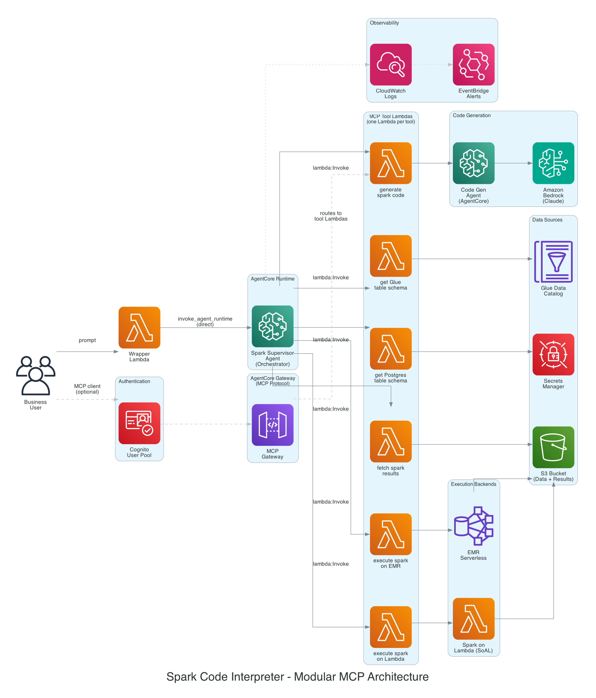

# Project Bluebear - Spark Code Interpreter

Project Bluebear is a conversational Gen AI solution that lets business users analyze datasets ranging from megabytes to petabytes using Amazon Bedrock Agents and Apache Spark. Submit natural language queries and get PySpark code that is automatically generated, validated, and executed.

Two execution backends work together:

- **Spark on AWS Lambda (SoAL)** -- lightweight, real-time processing for datasets up to 500 MB with sub-second validation latency.
- **Amazon EMR Serverless** -- scalable execution for larger datasets (MBs to PBs) with production-grade reliability.

Natural language is the interface. No ETL frameworks, no deployment pipelines -- just ask a question and get results.

## Architecture Overview




### Solution Flow

1. **Authenticate** -- User authenticates via Amazon Cognito and receives a JWT token with the `spark-api/spark.execute` scope.
2. **Natural Language Prompt** -- User asks a question via the React UI: *"Show me total sales by region over the last 12 months."*
3. **Gateway Authorization** -- The AgentCore Gateway validates the JWT and evaluates **Cedar authorization policies** to confirm the caller is permitted to invoke the agent and access the requested data sources.
4. **Sample Preparation** -- The supervisor agent extracts a 100 MB byte-range sample from the dataset (CSV, S3, or Glue). For CSVs, it reads the header row to extract column names and injects them into the code generation context, eliminating column-name mismatch errors.
5. **Bedrock Code Generation** -- Amazon Bedrock (Claude) generates a PySpark script based on the prompt, exact column names from the sample schema, and data source context.
6. **Cedar Policy Check** -- Before execution, Cedar policies verify the generated code does not contain destructive operations (DROP, DELETE, TRUNCATE) and that the target S3 buckets are project-tagged.
7. **Fast Validation Loop** -- Generated code runs on **SoAL** against the 100 MB sample to validate syntax and logic. Errors are captured and fed back to the model for repair. On success, execution logs are skipped and results are fetched immediately.
8. **Production Execution (large datasets only)** -- For datasets larger than 100 MB, the same validated PySpark script executes on **EMR Serverless** against the full dataset. Small datasets (≤ 100 MB) return the validation result directly — no second execution step.
9. **Results & Visualization** -- Results are returned to the React UI as tables and charts.
10. **Audit & Monitoring** -- Every step is captured by **CloudTrail** (agent invocations, model calls, data access). **EventBridge** rules fire alerts on failures, throttling, or unauthorized access attempts.

### Key Components

| Component | Purpose | Details |
|-----------|---------|---------|
| **Amazon Cognito** | Inbound authentication | User pool with JWT tokens and `spark-api/spark.execute` OAuth scope. Rejects unauthenticated requests at the gateway. |
| **Cedar Policies** | Agent authorization | Declarative rules evaluated before tool execution: session scoping, destructive-operation denial, S3 tag checks, validated-code gating. |
| **AgentCore Runtime** | Agent hosting | Runs the Spark orchestrator agent with local logic tools. External operations are delegated to MCP tool Lambdas. |
| **AgentCore Gateway** | MCP tool routing | Routes MCP tool calls to individual Lambda functions. 6 registered targets for code generation, execution, schema fetching, and result retrieval. |
| **Spark Orchestrator Agent** | End-to-end workflow | Pure orchestrator: coordinates code generation, validation, execution, and result fetching via MCP tool Lambdas. Keeps only decision logic locally. |
| **MCP Tool Lambdas** | Modular tool execution | 6 independent Lambda functions: `generate-spark-code`, `execute-spark-on-lambda`, `execute-spark-on-emr`, `get-glue-table-schema`, `get-postgres-table-schema`, `fetch-spark-results`. Each has its own timeout, memory, and IAM permissions. |
| **Code Generation Agent** | PySpark generation | Generates PySpark code based on user request, schema metadata, and data source context. Runs as `spark_code_generator` on AgentCore, invoked via MCP tool Lambda. |
| **Spark on Lambda (SoAL)** | Code execution | Executes PySpark code in a Docker container on Lambda with Hadoop-AWS JARs for S3A support. Used for validation and small datasets. |
| **User Interface (React + FastAPI)** | Frontend & API | React frontend (Cloudscape) with code editor, CSV upload, Glue/PostgreSQL table selection, and real-time progress tracking. FastAPI backend calls the Supervisor Agent. |
| **CloudTrail** | Audit trail | Captures all API calls across AgentCore, Bedrock, Lambda, EMR, S3, and Secrets Manager. Insights detect anomalies. |
| **EventBridge** | Real-time alerts | Rules trigger on agent failures, EMR job failures, Lambda throttling, and unauthorized access. Routes to SNS for ops notifications. |
| **AWS Services** | Infrastructure | S3, EMR Serverless, Lambda, CloudWatch, VPC for storage, compute, and network isolation. |

---

## Features

- **Natural language to PySpark** code generation using Amazon Bedrock Claude
- **Schema-aware code generation** -- CSV header row is extracted automatically and injected into the code generation prompt, eliminating column-name mismatch errors without requiring manual schema input
- **2-phase execution:** validation on a 100 MB sample (SoAL) + full-dataset execution on EMR Serverless only when needed (datasets > 100 MB); small datasets return validation results directly
- **Iterative validation loop (SoAL)** -- error detection, model repair, re-validation; execution logs only captured on failure to minimize latency on the success path
- **Dual execution backends:** SoAL (fast, ≤ 100 MB sample) + EMR Serverless (scalable, MBs to PBs)
- **React + FastAPI UI** with Cloudscape Design components:
  - Glue Data Catalog browsing and table selection
  - PostgreSQL connection management and table selection
  - CSV upload to S3
  - Code editor with syntax highlighting (Monaco)
  - Tabular result visualization
  - Real-time progress tracking (S3-based, polls every 3s during execution)
  - Session history
- **Security & governance:**
  - Inbound authentication via Amazon Cognito JWT with custom OAuth scopes (`spark-api/spark.execute`)
  - Cedar authorization policies on AgentCore -- session scoping, destructive-operation denial, S3 tag checks, validated-code gating for EMR
  - Least-privilege IAM execution roles per agent and downstream service (S3, Glue, Lambda, EMR)
  - Outbound auth to all downstream services via short-lived IAM role credentials -- no stored secrets
  - VPC-enabled execution with private S3 access
  - Code review in UI before execution; Cedar blocks DROP/DELETE/TRUNCATE at the agent level
- **Observability & alerting:**
  - CloudTrail audit trail across AgentCore, Bedrock, Lambda, EMR, S3, and Secrets Manager
  - CloudTrail Insights for anomaly detection (API call rate and error rate spikes)
  - EventBridge rules for real-time alerts: agent failures, EMR job failures, Lambda throttling, unauthorized access
  - SNS notifications to ops teams on critical events
- **Cost-effective:** pay only for compute time; reuse PySpark scripts across SoAL, EMR, and Glue

---

## Architecture Decision: SoAL vs. EMR Serverless

**Use SoAL when:**
- Dataset size ≤ 100 MB (validation sample) or small end-to-end datasets
- Need low-latency iterative code validation
- Ad-hoc or development queries

**Use EMR Serverless when:**
- Dataset size > 100 MB up to PBs
- Complex multi-step Spark jobs (joins, aggregations)
- Production analytics with SLA requirements

This solution always uses SoAL for **validation** on a 100 MB sample, then uses EMR Serverless for **production execution** on the full dataset if the file exceeds 100 MB. Small datasets skip the EMR step entirely, so code never needs to be rewritten for scale.

---

## Modular MCP Tool Architecture

The Spark Supervisor Agent follows a modular architecture where external operations are delegated to individual Lambda functions exposed as MCP tools on the AgentCore Gateway.

### Tool Split

**MCP Tool Lambdas (external operations, one Lambda each):**

| Tool | Lambda | Timeout | Purpose |
|------|--------|---------|---------|
| `generate_spark_code` | `dev-spark-tool-generate-spark-code` | 300s | Calls Code Gen Agent to produce PySpark |
| `execute_spark_on_lambda` | `dev-spark-tool-execute-spark-on-lambda` | 320s | Runs code on Spark-on-Lambda |
| `execute_spark_on_emr` | `dev-spark-tool-execute-spark-on-emr` | 900s | Submits jobs to EMR Serverless |
| `get_glue_table_schema` | `dev-spark-tool-get-glue-table-schema` | 30s | Fetches Glue table metadata |
| `get_postgres_table_schema` | `dev-spark-tool-get-postgres-table-schema` | 30s | Fetches PostgreSQL table schema |
| `fetch_spark_results` | `dev-spark-tool-fetch-spark-results` | 60s | Reads results from S3 |

**Local tools (pure logic, kept in supervisor agent):**
- `select_execution_platform` — Chooses Lambda vs EMR based on data size
- `validate_spark_code` — Checks code for required imports and output file writing
- `ensure_output_file_writing` — Injects output file logic into generated code
- `extract_python_code` — Extracts code from markdown blocks
- `extract_execution_logs` — Parses execution results from Lambda/EMR

### Call Flow

The supervisor agent follows a graph-based multi-agent architecture with two phases:

```
Wrapper Lambda (100 MB byte-range sample extraction)
  └── AgentCore Supervisor Agent (orchestrator)
        │
        ├── [local] prepare_csv_sample / prepare_glue_sample
        │     └── extract CSV header → schema_context (column names)
        │
        ├── Validation Agent (Agent 1 — always runs)
        │     ├── [MCP Lambda] generate_spark_code → Code Gen Agent
        │     │     └── prompt includes exact column names from schema_context
        │     ├── [MCP Lambda] execute_spark_on_lambda → Spark Lambda (sample)
        │     ├── SUCCESS: skip extract_execution_logs → fetch results directly
        │     │   FAILURE: [local] extract_execution_logs → retry code gen
        │     └── [MCP Lambda] fetch_spark_results → S3
        │
        └── Execution Agent (Agent 2 — large datasets only, > 100 MB)
              ├── [MCP Lambda] execute_spark_on_emr → EMR Serverless (full data)
              │   or execute_spark_on_lambda for medium datasets
              ├── SUCCESS: fetch results directly (no extract_execution_logs)
              └── [MCP Lambda] fetch_spark_results → S3
```

**2-phase vs 1-phase execution:**
- **Small datasets (≤ 100 MB)**: Validation Agent result is final — no Execution Agent invoked.
- **Large datasets (> 100 MB)**: After validation on the 100 MB sample, the Execution Agent runs the same code on the full dataset via EMR Serverless.

Config is passed as parameters in each MCP tool call (not environment variables), making the tools stateless and reusable.

> **Note:** The supervisor agent invokes MCP tool Lambdas directly via `lambda:InvokeFunction` for lower latency. The AgentCore Gateway exposes the same tools for external MCP clients (e.g., Claude Desktop, Cursor) but is not in the supervisor's execution path.

---

## Prerequisites

### AWS Account & Permissions

- AWS account with access to:
  - **Amazon Bedrock** (Claude model access, AgentCore)
  - **AWS Lambda** (functions, ECR container images)
  - **Amazon EMR Serverless** (applications, job execution)
  - **Amazon S3** (data buckets)
  - **AWS IAM** (roles, policies)
  - **AWS CloudFormation** (stack management)
  - **Amazon VPC** (optional, for private connectivity)
  - **Amazon Cognito** (JWT authentication)

### Local Prerequisites

- **AWS CLI v2** configured with appropriate credentials
- **Docker** with buildx support
- **Python 3.11+**
- **Node.js 18+** and npm
- **bedrock-agentcore-starter-toolkit** (`pip install bedrock-agentcore-starter-toolkit`)

### AWS Region

Deploy in a region supporting Bedrock + Lambda + EMR Serverless (e.g., `us-east-1`, `us-west-2`).

---

## Getting Started

### 1. Clone and Configure

```bash
git clone https://github.com/aws-samples/spark-code-interpreter.git
cd spark-code-interpreter
```

Ensure AWS credentials are configured:

```bash
aws configure
# or
export AWS_PROFILE=your-profile-name
```

### 2. Deploy Agents + Infrastructure

```bash
./scripts/deploy-all.sh
```

This deploys everything: Bedrock agents, Spark Lambda Docker image, and the CloudFormation stack. See [DEPLOYMENT_GUIDE.md](DEPLOYMENT_GUIDE.md) for step-by-step details.

### 3. Start the UI

```bash
export AWS_PROFILE=your-profile-name   # required — same profile used for deploy
./start-ui.sh
```

This starts the FastAPI backend on port 8000 and the React frontend on port 3000.

Or start them manually:

```bash
# Terminal 1: Backend
cd backend && ./run.sh

# Terminal 2: Frontend
cd frontend && npm install && npm run dev
```

### 4. Test

#### Upload test data to S3

```bash
aws s3 cp test-data/sample_sales.csv s3://spark-data-${ACCOUNT_ID}-${REGION}/test-input/sample_sales.csv
aws s3 cp test-data/employee_performance.csv s3://spark-data-${ACCOUNT_ID}-${REGION}/test-input/employee_performance.csv
```

#### Test via CLI

```bash
./scripts/test-calculation.sh "what is 7*10"
```

#### Test via the UI

1. Open http://localhost:3000
2. Upload a CSV using the **Upload CSV** button, or reference one already in S3
3. Enter a prompt, for example:
   - `Load the CSV from s3://spark-data-{account}-us-east-1/test-input/sample_sales.csv and show total sales by category`
   - `Load the CSV from s3://spark-data-{account}-us-east-1/test-input/employee_performance.csv and show average salary by department`
   - `What is 7 * 10`
4. Click **Generate & Execute** and watch the real-time progress indicator
5. Results appear in the **Execution Results** tab

#### Test data files

| File | Size | Scenario | Good queries |
|------|------|----------|-------------|
| `test-data/sample_sales.csv` | ~1.7 KB | Sales orders across regions and categories | "Total sales by region", "Top 5 products by revenue" |
| `test-data/employee_performance.csv` | ~500 rows | Employee performance across departments | "Average salary by department", "Count by performance rating", "Top 10 by bonus" |
| `test-data/employee_performance_large.csv` | ~23 MB | Scaled employee dataset (1-phase, ≤ 100 MB) | "Average salary by department", "Top performers by bonus" |
| `test-data/large_sales.csv` | ~150 MB | Large sales dataset (2-phase, triggers EMR) | "Total revenue by region", "Monthly sales trend" |

---

## Directory Structure

```
.
├── frontend/               # React + Cloudscape UI
│   └── src/components/     # CodeEditor, ExecutionResults, GlueTableSelector, etc.
├── backend/                # FastAPI backend
│   ├── main.py             # API endpoints (/generate, /execute, /upload-csv, etc.)
│   └── config.py           # Config loader (reads config/deployment-config.json)
├── agent-code/             # Bedrock AgentCore agents
│   ├── spark-supervisor-agent/   # Orchestrator (pure logic + MCP tool wrappers)
│   └── code-generation-agent/    # PySpark code generator (spark_code_generator)
├── mcp-tools/              # MCP tool Lambdas (one per tool)
│   ├── generate-spark-code/
│   ├── execute-spark-on-lambda/
│   ├── execute-spark-on-emr/
│   ├── get-glue-table-schema/
│   ├── get-postgres-table-schema/
│   ├── fetch-spark-results/
│   └── progress.py         # Shared S3-based progress tracking
├── agent-wrapper/          # Wrapper Lambda code
├── cloudformation/         # Infrastructure templates
├── Docker/                 # Spark Lambda Docker image
├── scripts/                # Deployment & test scripts
│   ├── deploy-all.sh       # Full deployment (agents + Docker + CloudFormation)
│   ├── deploy-mcp-tools.sh # Deploy MCP tool Lambdas
│   └── register-gateway-targets.py  # Register MCP tools on Gateway
├── config/                 # Configuration files
│   └── deployment-config.json  # Agent ARNs, S3 bucket (auto-populated by deploy)
├── test-data/              # Test CSV files
│   ├── sample_sales.csv    # 30 rows - sales data
│   └── employee_performance.csv  # 500 rows - HR data
├── images/                 # Architecture diagrams
├── start-ui.sh             # Launch frontend + backend
└── README.md               # This file
```

---

## Configuration

Configuration is layered: `config/deployment-config.json` (agent ARNs from deploy) → `backend/settings.json` (runtime overrides) → environment variables (container overrides).

| Component | Default Value |
|-----------|---------------|
| **Bedrock Model** | `us.anthropic.claude-sonnet-4-5-20250929-v1:0` |
| **Wrapper Lambda Timeout** | 900s (15 min) |
| **Spark Lambda Timeout** | 300s (5 min) |
| **S3 Structure** | `s3://spark-data-{account}-{region}/{session-id}/` |
| **Frontend Port** | 3000 |
| **Backend Port** | 8000 |

Environment variable overrides: `SPARK_SUPERVISOR_ARN`, `CODE_GEN_AGENT_ARN`, `BEDROCK_MODEL`, `SPARK_S3_BUCKET`.

---

## Workflow Example

### User Prompt

```
"Analyze sales trends by region for Q4 2024.
Show total revenue, top 3 products, and year-over-year growth."
```

### Behind the Scenes

1. **Bedrock Claude** generates PySpark code:
   ```python
   df = spark.read.parquet("s3a://my-bucket/sales_data/*.parquet")
   df_q4 = df.filter((df.date >= "2024-10-01") & (df.date < "2025-01-01"))

   revenue_by_region = df_q4.groupBy("region").agg(sum("sales"))
   top_products = df_q4.groupBy("product").agg(sum("sales")).sort(desc("sum(sales)")).limit(3)

   revenue_by_region.show()
   top_products.show()
   ```

2. **SoAL Validation** (on sample data): syntax valid, schema matches, executes in 520 ms.

3. **EMR Serverless Production Run**: auto-scales, executes on full dataset, returns results.

4. **React UI**: displays code, tables, and result summary.

---

## Security Best Practices

### 1. IAM Least-Privilege Policies

Every component runs with the minimum permissions required. No shared admin roles.

**Spark Lambda execution role** -- scoped to the specific S3 bucket and prefix:

```json
{
  "Version": "2012-10-17",
  "Statement": [
    {
      "Sid": "S3DataAccess",
      "Effect": "Allow",
      "Action": ["s3:GetObject", "s3:PutObject", "s3:ListBucket"],
      "Resource": [
        "arn:aws:s3:::spark-data-${AccountId}-${Region}",
        "arn:aws:s3:::spark-data-${AccountId}-${Region}/*"
      ]
    }
  ]
}
```

**AgentCore runtime role** -- only invoke specific agents and access specific models:

```json
{
  "Version": "2012-10-17",
  "Statement": [
    {
      "Sid": "InvokeAgents",
      "Effect": "Allow",
      "Action": ["bedrock-agentcore:InvokeAgentRuntime"],
      "Resource": [
        "arn:aws:bedrock-agentcore:${Region}:${AccountId}:runtime/spark_supervisor_agent-*",
        "arn:aws:bedrock-agentcore:${Region}:${AccountId}:runtime/code_generation_agent-*"
      ]
    },
    {
      "Sid": "InvokeModels",
      "Effect": "Allow",
      "Action": ["bedrock:InvokeModel", "bedrock:InvokeModelWithResponseStream"],
      "Resource": "arn:aws:bedrock:${Region}::foundation-model/anthropic.claude-*"
    }
  ]
}
```

**EMR Serverless execution role** -- scoped to the specific application and S3 paths:

```json
{
  "Version": "2012-10-17",
  "Statement": [
    {
      "Sid": "EMRJobExecution",
      "Effect": "Allow",
      "Action": [
        "emr-serverless:StartJobRun",
        "emr-serverless:GetJobRun",
        "emr-serverless:CancelJobRun"
      ],
      "Resource": "arn:aws:emr-serverless:${Region}:${AccountId}:/applications/${ApplicationId}/*"
    },
    {
      "Sid": "GlueCatalogRead",
      "Effect": "Allow",
      "Action": ["glue:GetDatabase*", "glue:GetTable*", "glue:GetPartition*"],
      "Resource": "*",
      "Condition": {
        "StringEquals": {"glue:ResourceTag/Project": "bluebear"}
      }
    }
  ]
}
```

### 2. Inbound Authentication (Callers → AgentCore)

All inbound requests to the AgentCore gateway are authenticated via **Amazon Cognito JWT tokens** with custom OAuth scopes.

**Cognito configuration** (defined in `cloudformation/spark-complete-stack.yml`):

- **User Pool** with password policies and MFA support
- **Resource Server** defining the `spark-api` scope namespace
- **Custom scope**: `spark-api/spark.execute` -- only users granted this scope can invoke the agent
- **App Client** with client credentials grant for service-to-service calls

**Request flow:**

```
Client → Cognito (authenticate) → JWT token with spark-api/spark.execute scope
      → AgentCore Gateway (validates JWT, checks scope)
      → Spark Supervisor Agent
```

The FastAPI backend validates the JWT before forwarding to AgentCore. Unauthenticated requests are rejected at the gateway level.

### 3. Outbound Authentication (AgentCore → Downstream Services)

AgentCore agents authenticate to downstream AWS services using **IAM execution roles** attached to the agent runtime. No long-lived credentials are stored.

| Agent → Service | Auth Method |
|----------------|-------------|
| Supervisor Agent → MCP Tool Lambdas | IAM role (lambda:InvokeFunction on `dev-spark-tool-*`) |
| MCP Tool → Code Gen Agent | IAM role (bedrock-agentcore:InvokeAgentRuntime) |
| MCP Tool → Spark Lambda | IAM role (lambda:InvokeFunction) |
| MCP Tool → EMR Serverless | IAM role (emr-serverless:StartJobRun) |
| MCP Tool → S3 | IAM role (s3:GetObject, s3:PutObject) |
| MCP Tool → Glue Catalog | IAM role (glue:GetTable, glue:GetDatabase) |
| MCP Tool → Secrets Manager | IAM role (secretsmanager:GetSecretValue) for PostgreSQL credentials |
| Supervisor Agent → Bedrock Models | IAM role (bedrock:InvokeModel) |

Each agent runtime has its own IAM role. The Spark Supervisor Agent role cannot access resources outside its designated S3 bucket, Glue databases, or specific Lambda functions.

### 4. Cedar Authorization Policies for AgentCore

Use **Cedar policies** to define fine-grained authorization rules for what the agent can and cannot do. Cedar policies are evaluated by AgentCore before tool execution, providing a declarative authorization layer beyond IAM.

**Policy: Allow Spark code execution only for authorized sessions**

```cedar
permit (
  principal == AgentCore::Agent::"spark_supervisor_agent",
  action == AgentCore::Action::"InvokeTool",
  resource == AgentCore::Tool::"spark_code_interpreter"
) when {
  context.session_id.isValid() &&
  context.execution_platform in ["lambda", "emr"]
};
```

**Policy: Deny access to production EMR for non-validated code**

```cedar
forbid (
  principal == AgentCore::Agent::"spark_supervisor_agent",
  action == AgentCore::Action::"InvokeTool",
  resource == AgentCore::Tool::"emr_execution"
) when {
  context.code_validated == false
};
```

**Policy: Restrict S3 data access to project-tagged buckets**

```cedar
permit (
  principal == AgentCore::Agent::"spark_supervisor_agent",
  action == AgentCore::Action::"InvokeTool",
  resource == AgentCore::Tool::"data_read"
) when {
  resource.s3_bucket.hasTag("Project", "bluebear")
};
```

**Policy: Deny destructive operations**

```cedar
forbid (
  principal is AgentCore::Agent,
  action == AgentCore::Action::"InvokeTool",
  resource == AgentCore::Tool::"spark_code_interpreter"
) when {
  context.spark_code.contains("DROP TABLE") ||
  context.spark_code.contains("DELETE FROM") ||
  context.spark_code.contains("TRUNCATE")
};
```

Cedar policies are stored alongside the agent configuration and evaluated at runtime. They provide deterministic, auditable authorization that complements IAM roles.

### 5. CloudTrail for Workload Monitoring

Enable **AWS CloudTrail** to capture all API calls made by the agents and infrastructure. This provides a complete audit trail of who invoked what, when, and with what parameters.

**Enable CloudTrail for AgentCore, Lambda, and EMR:**

```bash
aws cloudtrail create-trail \
  --name spark-code-interpreter-trail \
  --s3-bucket-name my-cloudtrail-bucket \
  --is-multi-region-trail \
  --enable-log-file-validation

aws cloudtrail start-logging --name spark-code-interpreter-trail
```

**Key events to monitor:**

| Event Source | Event Name | What It Captures |
|-------------|------------|-----------------|
| `bedrock-agentcore.amazonaws.com` | `InvokeAgentRuntime` | Every agent invocation (prompt, session, duration) |
| `bedrock.amazonaws.com` | `InvokeModel` | Every model call (model ID, token count) |
| `lambda.amazonaws.com` | `Invoke` | Every Spark Lambda execution |
| `emr-serverless.amazonaws.com` | `StartJobRun` | Every EMR job submission |
| `s3.amazonaws.com` | `PutObject`, `GetObject` | Data access patterns |
| `secretsmanager.amazonaws.com` | `GetSecretValue` | Credential access for PostgreSQL |

**CloudTrail Insights** -- enable anomaly detection to flag unusual patterns:

```bash
aws cloudtrail put-insight-selectors \
  --trail-name spark-code-interpreter-trail \
  --insight-selectors '[{"InsightType": "ApiCallRateInsight"}, {"InsightType": "ApiErrorRateInsight"}]'
```

This automatically detects spikes in agent invocations or error rates.

### 6. EventBridge for Critical Alerts

Configure **Amazon EventBridge** rules to trigger alerts when critical events occur. This enables real-time monitoring of agent health, failures, and security anomalies.

**Rule 1: Agent invocation failures**

```json
{
  "source": ["aws.bedrock-agentcore"],
  "detail-type": ["AgentCore Agent Runtime Invocation"],
  "detail": {
    "errorCode": [{"exists": true}]
  }
}
```

```bash
aws events put-rule \
  --name spark-agent-invocation-failures \
  --event-pattern '{
    "source": ["aws.bedrock-agentcore"],
    "detail-type": ["AWS API Call via CloudTrail"],
    "detail": {
      "eventSource": ["bedrock-agentcore.amazonaws.com"],
      "eventName": ["InvokeAgentRuntime"],
      "errorCode": [{"exists": true}]
    }
  }'
```

**Rule 2: EMR Serverless job failures**

```bash
aws events put-rule \
  --name spark-emr-job-failures \
  --event-pattern '{
    "source": ["aws.emr-serverless"],
    "detail-type": ["EMR Serverless Job Run State Change"],
    "detail": {
      "state": ["FAILED", "CANCELLED"]
    }
  }'
```

**Rule 3: Lambda throttling or errors**

```bash
aws events put-rule \
  --name spark-lambda-errors \
  --event-pattern '{
    "source": ["aws.lambda"],
    "detail-type": ["AWS API Call via CloudTrail"],
    "detail": {
      "eventSource": ["lambda.amazonaws.com"],
      "eventName": ["Invoke"],
      "errorCode": ["TooManyRequestsException", "ServiceException"]
    }
  }'
```

**Rule 4: Unauthorized access attempts**

```bash
aws events put-rule \
  --name spark-unauthorized-access \
  --event-pattern '{
    "source": ["aws.bedrock-agentcore"],
    "detail-type": ["AWS API Call via CloudTrail"],
    "detail": {
      "errorCode": ["AccessDeniedException", "UnauthorizedException"]
    }
  }'
```

**Route alerts to SNS for notifications:**

```bash
# Create SNS topic
aws sns create-topic --name spark-agent-alerts
aws sns subscribe --topic-arn arn:aws:sns:us-east-1:${ACCOUNT_ID}:spark-agent-alerts \
  --protocol email --notification-endpoint ops-team@example.com

# Attach to all EventBridge rules
for rule in spark-agent-invocation-failures spark-emr-job-failures spark-lambda-errors spark-unauthorized-access; do
  aws events put-targets --rule $rule \
    --targets "Id=sns-target,Arn=arn:aws:sns:us-east-1:${ACCOUNT_ID}:spark-agent-alerts"
done
```

**Summary of alert coverage:**

| Alert | Trigger | Severity |
|-------|---------|----------|
| Agent invocation failure | Any AgentCore error | High |
| EMR job failure | Job state = FAILED or CANCELLED | High |
| Lambda throttling | TooManyRequestsException | Medium |
| Unauthorized access | AccessDeniedException on any agent endpoint | Critical |
| CloudTrail anomaly | Unusual API call rate spike (via Insights) | Medium |

### 7. VPC Configuration

Deploy SoAL and EMR Serverless in a VPC for private S3 access. The CloudFormation stack supports VPC parameters (`VpcId`, `PrivateSubnetIds`).

### 8. Code Review

The React UI allows users to review generated PySpark before execution, approve or reject operations, and export code for audit.

### 9. Encryption

All data in transit uses TLS. Enable S3 default encryption and EMRFS encryption for data at rest.

---

## Cost Optimization

### SoAL (Lambda)
- Pay per 100 ms request + data transfer
- ~$0.02-$0.10 per validation iteration
- Best for: small datasets (<500 MB), iterative testing

### EMR Serverless
- Pay per DPU-hour
- $0.35/DPU-hour; typical 1 TB query = $5-$20
- Scales to zero when idle

### Tips
1. Filter data early in generated code to reduce processing
2. Use Parquet over CSV for better compression and columnar performance
3. Partition S3 data by date (`s3://bucket/year=2024/month=01/`)
4. EMR Serverless auto-scales down to 0 when idle
5. Set CloudWatch budget alerts on Lambda + EMR costs

---

## Troubleshooting

### Lambda Timeout
```bash
aws logs tail /aws/lambda/dev-spark-on-lambda --follow --region us-east-1
```
Increase timeout in Settings UI or `backend/settings.json`.

### MCP Tool Lambda Errors
```bash
# Check individual tool Lambda logs
aws logs tail /aws/lambda/dev-spark-tool-generate-spark-code --since 5m --region us-east-1
aws logs tail /aws/lambda/dev-spark-tool-execute-spark-on-lambda --since 5m --region us-east-1
aws logs tail /aws/lambda/dev-spark-tool-fetch-spark-results --since 5m --region us-east-1
```

### EMR Serverless Job Failures
```bash
aws emr-serverless get-job-run \
  --application-id <app-id> \
  --job-run-id <job-id> \
  --region us-east-1
```

### Bedrock Rate Limits
Request quota increase in AWS Console → Service Quotas. The backend includes exponential backoff for throttled requests.

### S3 Write Issues
Check Lambda logs for JAR classpath errors. The Docker image includes Hadoop-AWS JARs for S3A support.

### Gateway Timeout
The MCP gateway may time out at ~30s while the Lambda continues. Check S3 for results.

### NoSuchBucket error on CSV upload
The backend config has `"None"` for `s3_bucket`. This happens when the CloudFormation step of `deploy-all.sh` exits early (e.g. update fails or stack is unchanged) before writing stack outputs to `config/deployment-config.json`.

Fix: re-run the full deploy to regenerate the config, or check the actual bucket name and patch it manually:
```bash
# Find the correct bucket name
aws sts get-caller-identity --query Account --output text   # → ACCOUNT_ID
# Bucket follows the pattern: spark-data-ACCOUNT_ID-REGION
# e.g. spark-data-914787431788-us-east-1

# Verify it exists
aws s3 ls s3://spark-data-ACCOUNT_ID-REGION --region us-east-1
```
Then update `config/deployment-config.json`:
```json
{ "spark": { "s3_bucket": "spark-data-ACCOUNT_ID-REGION", ... } }
```

### Wrong region when running start-ui.sh
The backend and all Lambda/S3 resources must be in the same region. Set `AWS_REGION` before starting:
```bash
export AWS_PROFILE=your-profile
export AWS_REGION=us-east-1   # match the region used during deploy
bash start-ui.sh
```
If unset, the backend defaults to `us-east-1`. Confirm your deployed region:
```bash
aws lambda get-function --function-name dev-spark-agent-wrapper --region us-east-1
```

### Glue query fails with "No sample data available" or "No module named 'progress'"
The `get-glue-table-schema` Lambda is missing its dependencies. Re-run `deploy-mcp-tools.sh` with the correct region:
```bash
AWS_REGION=us-east-1 bash scripts/deploy-mcp-tools.sh
```
Key requirements for the Glue schema Lambda:
- `progress.py` must be co-deployed (the script copies it automatically from `mcp-tools/`)
- `pandas` and `pyarrow` must be installed for Linux/x86_64 (the script uses `--platform manylinux2014_x86_64`)
- The resulting zip is ~80MB and is automatically staged via S3

### Glue query fails with "AccessDenied" on ListObjectsV2
The MCP tool Lambda role only has S3 access to the `spark-data-ACCOUNT_ID-REGION` bucket by default. If your Glue tables live in a different S3 bucket (e.g. `sl-data-store-*`), add read permissions manually:
```bash
# Find the current inline policy
aws iam get-role-policy --role-name dev-spark-mcp-tools-role --policy-name dev-spark-mcp-tools-policy

# Add the Glue data bucket to the S3 statement Resource list, then update:
aws iam put-role-policy --role-name dev-spark-mcp-tools-role \
  --policy-name dev-spark-mcp-tools-policy \
  --policy-document file://updated-policy.json
```
The `deploy-mcp-tools.sh` script only grants S3 access to the CloudFormation-managed `spark-data-ACCOUNT_ID-REGION` bucket. To allow access to additional Glue data buckets, add them explicitly to the S3 statement in the script and redeploy.

### Lambda invocation fails in test scripts (AWS CLI v2)
AWS CLI v2 requires `--cli-binary-format raw-in-base64-out` for inline JSON payloads. Without it, `aws lambda invoke` silently fails on Python 3.14+ environments.
```bash
aws lambda invoke \
  --function-name dev-spark-agent-wrapper \
  --payload '{"prompt":"what is 7*10"}' \
  --cli-binary-format raw-in-base64-out \
  --region us-east-1 \
  /tmp/response.json
```

---

## Cleanup

```bash
./scripts/cleanup.sh
```

Or manually:

```bash
aws cloudformation delete-stack --stack-name dev-spark-complete-stack --region us-east-1
```

---

## References

- [YouTube: Spark Code Interpreter - Big Data for Business Users](https://www.youtube.com/watch?v=iz_NQ00hBek)
- [AWS Blog: Spark on AWS Lambda (SoAL)](https://aws.amazon.com/blogs/big-data/spark-on-aws-lambda-an-apache-spark-runtime-for-aws-lambda/)
- [AWS Docs: Amazon EMR Serverless](https://docs.aws.amazon.com/emr/latest/EMR-Serverless-UserGuide/)
- [GitHub: spark-code-interpreter](https://github.com/aws-samples/spark-code-interpreter)

---

**Version**: 4.1.0 | **Model**: Claude Sonnet 4.6 | **UI**: React + FastAPI + Cloudscape
