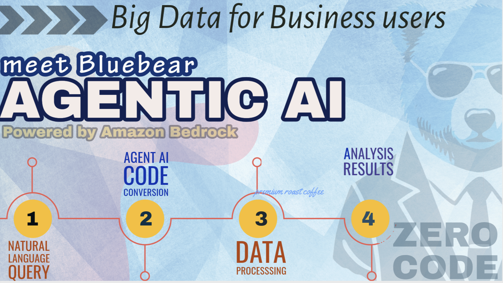
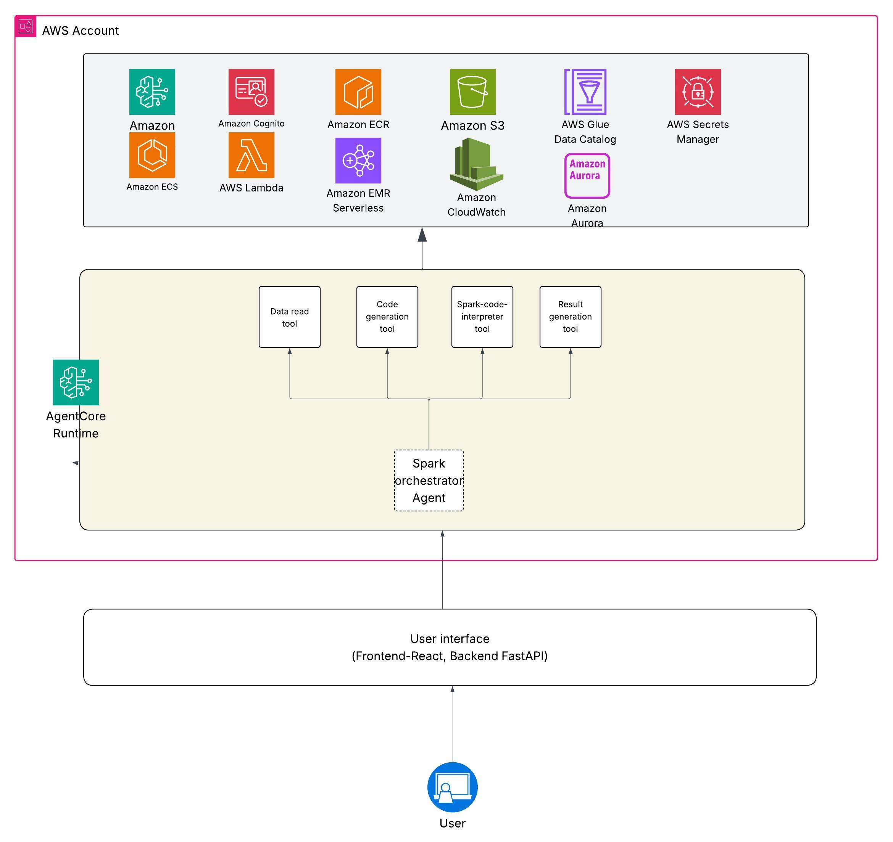

# Project Bluebear - Spark Code Interpreter

Project Bluebear is a conversational Gen AI solution that lets business users analyze datasets ranging from megabytes to petabytes using Amazon Bedrock Agents and Apache Spark. Submit natural language queries and get PySpark code that is automatically generated, validated, and executed.

Two execution backends work together:

- **Spark on AWS Lambda (SoAL)** -- lightweight, real-time processing for datasets up to 500 MB with sub-second validation latency.
- **Amazon EMR Serverless** -- scalable execution for larger datasets (MBs to PBs) with production-grade reliability.

Natural language is the interface. No ETL frameworks, no deployment pipelines -- just ask a question and get results.



## Architecture Overview



### Solution Flow

1. **Natural Language Prompt** -- User asks a question via the React UI: *"Show me total sales by region over the last 12 months."*
2. **Bedrock Code Generation** -- Amazon Bedrock (Claude) generates a PySpark script based on the prompt, dataset schema, and historical context.
3. **Fast Validation Loop** -- Generated code runs on **SoAL** to validate syntax and logic (~550 ms). Errors are fed back to the model for repair, iterating until success.
4. **Production Execution** -- Once validated, the same PySpark script executes on **EMR Serverless** against the full dataset.
5. **Results & Visualization** -- Results are returned to the React UI as tables and charts.

### Key Components

| Component | Purpose | Details |
|-----------|---------|---------|
| **AgentCore Runtime** | Agent + tool hosting | Runs the Spark orchestrator agent and its tools inside AgentCore. |
| **Spark Orchestrator Agent** | End-to-end workflow | Orchestrates: read data, generate PySpark, execute via Spark-code-interpreter, format results. |
| **Data Read Tool** | Dataset access | Reads from S3 / Glue catalog (extensible to Snowflake, Databricks via MCP). |
| **Code Generation Tool** | PySpark generation | Generates or refines PySpark based on user request and schema metadata. |
| **Spark-code-interpreter Tool** | Code validation | Interprets generated code, iteratively fixes errors. |
| **Result Generation Tool** | User-friendly output | Aggregates Spark results into tables, charts, and natural-language summaries. |
| **User Interface (React + FastAPI)** | Frontend & API | React frontend and FastAPI backend that collect queries, invoke AgentCore, and render results. |
| **AWS Services** | Infrastructure | S3, EMR Serverless, Lambda, CloudWatch, Cognito for storage, compute, and observability. |

---

## Features

- **Natural language to PySpark** code generation using Amazon Bedrock Claude
- **Iterative validation loop (SoAL)** -- error detection, model repair, re-validation
- **Dual execution backends:** SoAL (fast, <500 MB) + EMR Serverless (scalable, MBs to PBs)
- **React + FastAPI UI** with Cloudscape Design components:
  - Glue Data Catalog browsing and table selection
  - PostgreSQL connection management and table selection
  - CSV upload to S3
  - Code editor with syntax highlighting (Monaco)
  - Tabular result visualization
- **Security:** scoped IAM roles, VPC-enabled execution, JWT auth via Cognito
- **Cost-effective:** pay only for compute time; reuse PySpark scripts across SoAL, EMR, and Glue

---

## Architecture Decision: SoAL vs. EMR Serverless

**Use SoAL when:**
- Dataset size < 500 MB
- Need < 1 second latency (iterative code validation)
- Ad-hoc or development queries

**Use EMR Serverless when:**
- Dataset size > 500 MB up to PBs
- Complex multi-step Spark jobs (joins, aggregations)
- Production analytics with SLA requirements

This solution uses SoAL for **validation** and EMR Serverless for **production execution**, so code never needs to be rewritten for scale.

---

## Prerequisites

### AWS Account & Permissions

- AWS account with access to:
  - **Amazon Bedrock** (Claude model access, AgentCore)
  - **AWS Lambda** (functions, ECR container images)
  - **Amazon EMR Serverless** (applications, job execution)
  - **Amazon S3** (data buckets)
  - **AWS IAM** (roles, policies)
  - **AWS CloudFormation** (stack management)
  - **Amazon VPC** (optional, for private connectivity)
  - **Amazon Cognito** (JWT authentication)

### Local Prerequisites

- **AWS CLI v2** configured with appropriate credentials
- **Docker** with buildx support
- **Python 3.11+**
- **Node.js 18+** and npm
- **bedrock-agentcore-starter-toolkit** (`pip install bedrock-agentcore-starter-toolkit`)

### AWS Region

Deploy in a region supporting Bedrock + Lambda + EMR Serverless (e.g., `us-east-1`, `us-west-2`).

---

## Getting Started

### 1. Clone and Configure

```bash
git clone https://github.com/aws-samples/spark-code-interpreter.git
cd spark-code-interpreter
```

Ensure AWS credentials are configured:

```bash
aws configure
# or
export AWS_PROFILE=your-profile-name
```

### 2. Deploy Agents + Infrastructure

```bash
./scripts/deploy-all.sh
```

This deploys everything: Bedrock agents, Spark Lambda Docker image, and the CloudFormation stack. See [DEPLOYMENT_GUIDE.md](DEPLOYMENT_GUIDE.md) for step-by-step details.

### 3. Start the UI

```bash
./start-ui.sh
```

This starts the FastAPI backend on port 8000 and the React frontend on port 3000.

Or start them manually:

```bash
# Terminal 1: Backend
cd backend && ./run.sh

# Terminal 2: Frontend
cd frontend && npm install && npm run dev
```

### 4. Test

```bash
# Via test script
./scripts/test-calculation.sh "what is 7*10"

# Or via the UI at http://localhost:3000
```

---

## Directory Structure

```
.
├── frontend/               # React + Cloudscape UI
├── backend/                # FastAPI backend
├── agent-code/             # Bedrock AgentCore agents
│   ├── spark-supervisor-agent/
│   └── code-generation-agent/
├── agent-wrapper/          # Wrapper Lambda code
├── cloudformation/         # Infrastructure templates
├── Docker/                 # Spark Lambda Docker image
├── scripts/                # Deployment & test scripts
├── config/                 # Configuration files
├── images/                 # Architecture diagrams
├── start-ui.sh             # Launch both frontend + backend
├── README.md               # This file
└── DEPLOYMENT_GUIDE.md     # Detailed deployment instructions
```

---

## Configuration

Configuration is layered: `config/deployment-config.json` (agent ARNs from deploy) → `backend/settings.json` (runtime overrides) → environment variables (container overrides).

| Component | Default Value |
|-----------|---------------|
| **Bedrock Model** | `us.anthropic.claude-sonnet-4-5-20250929-v1:0` |
| **Wrapper Lambda Timeout** | 900s (15 min) |
| **Spark Lambda Timeout** | 300s (5 min) |
| **S3 Structure** | `s3://spark-data-{account}-{region}/{session-id}/` |
| **Frontend Port** | 3000 |
| **Backend Port** | 8000 |

Environment variable overrides: `SPARK_SUPERVISOR_ARN`, `CODE_GEN_AGENT_ARN`, `BEDROCK_MODEL`, `SPARK_S3_BUCKET`.

---

## Workflow Example

### User Prompt

```
"Analyze sales trends by region for Q4 2024.
Show total revenue, top 3 products, and year-over-year growth."
```

### Behind the Scenes

1. **Bedrock Claude** generates PySpark code:
   ```python
   df = spark.read.parquet("s3a://my-bucket/sales_data/*.parquet")
   df_q4 = df.filter((df.date >= "2024-10-01") & (df.date < "2025-01-01"))

   revenue_by_region = df_q4.groupBy("region").agg(sum("sales"))
   top_products = df_q4.groupBy("product").agg(sum("sales")).sort(desc("sum(sales)")).limit(3)

   revenue_by_region.show()
   top_products.show()
   ```

2. **SoAL Validation** (on sample data): syntax valid, schema matches, executes in 520 ms.

3. **EMR Serverless Production Run**: auto-scales, executes on full dataset, returns results.

4. **React UI**: displays code, tables, and result summary.

---

## Security Best Practices

### IAM Least Privilege

Scope S3 policies to specific bucket prefixes:

```json
{
  "Effect": "Allow",
  "Action": ["s3:GetObject", "s3:ListBucket"],
  "Resource": [
    "arn:aws:s3:::my-spark-data-bucket/datasets/*",
    "arn:aws:s3:::my-spark-data-bucket"
  ]
}
```

### VPC Configuration

Deploy SoAL and EMR Serverless in a VPC for private S3 access. The CloudFormation stack supports VPC parameters (`VpcId`, `PrivateSubnetIds`).

### Code Review

The React UI allows users to review generated PySpark before execution, approve or reject operations, and export code for audit.

### Encryption

All data in transit uses TLS. Enable S3 default encryption and EMRFS encryption for data at rest.

---

## Cost Optimization

### SoAL (Lambda)
- Pay per 100 ms request + data transfer
- ~$0.02-$0.10 per validation iteration
- Best for: small datasets (<500 MB), iterative testing

### EMR Serverless
- Pay per DPU-hour
- $0.35/DPU-hour; typical 1 TB query = $5-$20
- Scales to zero when idle

### Tips
1. Filter data early in generated code to reduce processing
2. Use Parquet over CSV for better compression and columnar performance
3. Partition S3 data by date (`s3://bucket/year=2024/month=01/`)
4. EMR Serverless auto-scales down to 0 when idle
5. Set CloudWatch budget alerts on Lambda + EMR costs

---

## Troubleshooting

### Lambda Timeout
```bash
aws logs tail /aws/lambda/sparkOnLambda-spark-code-interpreter --follow
```
Increase timeout in Settings UI or `backend/settings.json`.

### EMR Serverless Job Failures
```bash
aws emr-serverless get-job-run \
  --application-id <app-id> \
  --job-run-id <job-id> \
  --region us-east-1
```

### Bedrock Rate Limits
Request quota increase in AWS Console → Service Quotas. The backend includes exponential backoff for throttled requests.

### S3 Write Issues
Check Lambda logs for JAR classpath errors. The Docker image includes Hadoop-AWS JARs for S3A support.

### Gateway Timeout
The MCP gateway may time out at ~30s while the Lambda continues. Check S3 for results.

---

## Cleanup

```bash
./scripts/cleanup.sh
```

Or manually:

```bash
aws cloudformation delete-stack --stack-name spark-code-interpreter --region us-east-1
```

---

## References

- [YouTube: Spark Code Interpreter - Big Data for Business Users](https://www.youtube.com/watch?v=iz_NQ00hBek)
- [AWS Blog: Spark on AWS Lambda (SoAL)](https://aws.amazon.com/blogs/big-data/spark-on-aws-lambda-an-apache-spark-runtime-for-aws-lambda/)
- [AWS Docs: Amazon EMR Serverless](https://docs.aws.amazon.com/emr/latest/EMR-Serverless-UserGuide/)
- [GitHub: spark-code-interpreter](https://github.com/aws-samples/spark-code-interpreter)

---

**Version**: 3.0.0 | **Model**: Claude Sonnet 4.5 | **UI**: React + FastAPI
