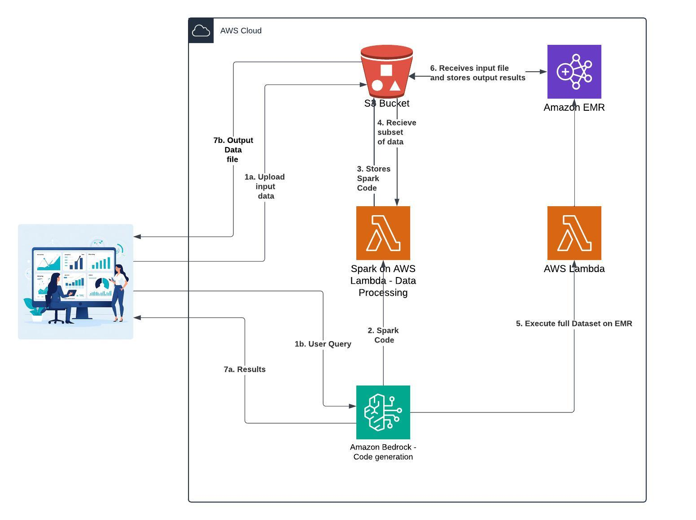

# Project Bluebear - Big Data for Business Users
Project Bluebear is an attempt to allow business users to use natural language queries for performing Big Data Analytics and receive results. It provides a zero code conversational interface where users can ask questions, upload documents, and receive responses from the AI assistant. Under the hood it uses GenAI to convert natural language queries into Spark code for performing big data analytics. 

## Architecture
This project provides a conversational interface using [Bedrock Claude Chatbot](https://github.com/aws-samples/bedrock-claude-chatbot). Amazon Bedrock is used for generating the spark code based on the user prompt. The spark code is then run on a lightweight [Apache Spark on AWS Lambda(SoAL) framework](https://github.com/aws-samples/spark-on-aws-lambda) to provide analysis results to the user. If the input data file is big, a subset of data from the file will be used to provide the results. User can ask to generate the results for full dataset if the results look good. The input data, spark code script and the output data will be stored in the S3 bucket to be used by Spark on AWS Lambda and Amazon EMR.

## Deploy and run Streamlit App on AWS EC2 (I tested this on the Ubuntu Image)
* [Create a new ec2 instance](https://docs.aws.amazon.com/AWSEC2/latest/UserGuide/EC2_GetStarted.html)
* Expose TCP port range 8500-8510 on Inbound connections of the attached Security group to the ec2 instance. TCP port 8501 is needed for Streamlit to work. See image below
* 
* EC2 [instance profile role](https://docs.aws.amazon.com/IAM/latest/UserGuide/id_roles_use_switch-role-ec2_instance-profiles.html) has the required permissions to access the services used by this application mentioned above.
* [Connect to your ec2 instance](https://docs.aws.amazon.com/AWSEC2/latest/UserGuide/AccessingInstances.html)
* Run the appropiate commands to update the ec2 instance (`sudo apt update` and `sudo apt upgrade` -for Ubuntu)
* Clone this git repo `git clone [github_link]`
* Install python3 and pip if not already installed, `sudo apt install python3` and `sudo apt install python3-pip`.
* If you decide to use Python Libs for PDF and image processing, this requires tesserect-ocr. Run the following command:
    - If using Centos-OS or Amazon-Linux:
        - sudo rpm -Uvh https://dl.fedoraproject.org/pub/epel/epel-release-latest-7.noarch.rpm
        - sudo yum -y update
        - sudo yum install -y tesseract
    - For Ubuntu or Debian:
        - sudo apt-get install tesseract-ocr-all -y
* Install the dependencies by running the command `sudo pip install -r req.txt --upgrade`
* Run command `tmux new -s mysession` to create a new session. Then in the new session created `cd` into the **ChatBot** dir and run `python3 -m streamlit run bedrock-chat.py` to start the streamlit app. This allows you to run the Streamlit application in the background and keep it running even if you disconnect from the terminal session.
* Copy the **External URL** link generated and paste in a new browser tab.
* **⚠ NOTE:** The generated link is not secure! For [additional guidance](https://github.com/aws-samples/deploy-streamlit-app). 
To stop the `tmux` session, in your ec2 terminal Press `Ctrl+b`, then `d` to detach. to kill the session, run `tmux kill-session -t mysession`

## Future Road Map
TBD

## Cleanup